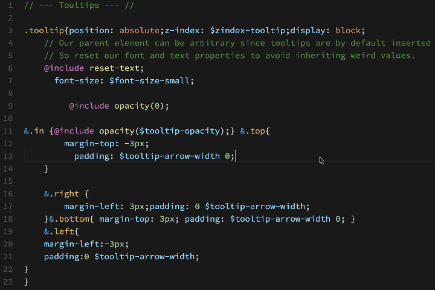

# Sass Formatter

Sass formatter extension for VS Code built on top of **sass-convert**. Beautify *sass*, *scss* and *css* files.

## Requirements

Requires **Ruby Sass** command line tools to be installed. Tested sass command line tools: **Ruby Sass 3.5.6**.

It is important to say that at this moment **Dart Sass** introduced on [March 26, 2018](http://sass.logdown.com/posts/7045860-dart-sass-100-is-released), is not yet supported by this extension.

More details about [Sass Syntax](http://sass-lang.com/documentation/file.SASS_REFERENCE.html#syntax) used in this formatter. And here you can find [Sass Changelog](http://sass-lang.com/documentation/file.SASS_CHANGELOG.html).

### Install Ruby Sass via command line

This procedure was official before *March 26, 2018*. With the release of Dart Sass 1.0.0, Ruby Sass was officially deprecated. I'll try to replace Ruby Sass with Dart Sass before *June 26, 2018*.

More official links about a transition from Ruby Sass to Dart Sass:

* [Ruby Sass is Deprecated](http://sass.logdown.com/posts/7081811)
* [Dart Sass 1.0.0 is Released](http://sass.logdown.com/posts/7045860-dart-sass-100-is-released)
* [Announcing Dart Sass](http://sass.logdown.com/posts/1022316-announcing-dart-sass)

So instead of following this [Install Sass](http://sass-lang.com/install), which will install Dart Sass, please follow  the old official procedure below.

#### Linux

If you're using a distribution of Linux, you'll need to install Ruby first. You can install Ruby through the apt package manager, rbenv, or rvm. You will also need the build-essential package, available through a package manager as well.

```bash
sudo gem install sass --no-user-install
```

#### Windows

Before you start using Sass you will need to install Ruby. The fastest way to get Ruby on your Windows computer is to use [Ruby Installer](https://rubyinstaller.org). It's a single-click installer that will get everything set up for you super fast.

The installer will also install a Ruby command line powershell application that will let you use the Ruby libraries.

#### Mac

If you prefer the command line over an application then getting Sass set up is a fairly quick process. Sass has a Ruby dependency but if you're using a Mac, congratulations, Ruby comes pre-installed.

#### Install Ruby Sass

Here's the quickest way we've found to start using Sass by using the command line:

1. **Open your Terminal or Command Prompt.** On the Mac the Terminal.app comes installed by default. It's located in your "Utilities" folder. On Windows, run `cmd`.

2. **Install Ruby Sass**. Ruby uses Gems to manage its various packages of code like Sass. In your open terminal window type:

```bash
gem install sass
```

This will install Sass and any dependencies for you. It's pretty magical. If you get an error message then it's likely you will need to use the `sudo` command to install the Sass gem. It would look like:

```bash
sudo gem install sass
```

3. **Double-check.** You should now have Sass installed, but it never hurts to double-check. In your terminal application you can type:

```bash
sass --version
sass-convert --version
```

It should return `Ruby Sass 3.5.6`.

## Usage

Files can be formatted on-demand by right-clicking in the document and selecting **Format Document** in the editor context menu, by using the associated keyboard shortcut, or by running command **Format Document** from the **Command Palette**.

Default keyboard shortcuts for **Format Document** command:
* macOS: **Shift+Alt+F**
* Linux: **Ctrl+Shift+I**
* Windows: **Shift+Alt+F**

Selection can be formatted on-demand by right-clicking in the document and selecting **Format Selection** in the editor context menu, by using the associated keyboard shortcut, or by running command **Format Selection** from the **Command Palette**.

Default keyboard shortcuts for **Format Selection** command:
* macOS: **Cmd+K Cmd+F**
* Linux: **Ctrl+K Ctrl+F**
* Windows: **Ctrl+K Ctrl+F**

By default, formatter using **UTF-8** encoding to ensure proper encoding of all characters. This allows us to use Unicode characters directly in our styling files:

```scss
// UTF-8 example
.icon-prev {
    &:before {
        // Unicode Character 'SINGLE LEFT-POINTING ANGLE QUOTATION MARK' (U+2039)
        content: '‹';
    }
}

// ASCII example
.icon-prev {
    &:before {
        // Unicode Character 'SINGLE LEFT-POINTING ANGLE QUOTATION MARK' (U+2039)
        content: '\2039';
    }
}
```

To automatically format on paste, add the following to your *settings.json* file: `"editor.formatOnPaste": true`.

To automatically format a file on saving, add the following to your *settings.json* file: `"editor.formatOnSave": true`.

To automatically insert a final newline at the end of the file when saving it, add the following to your *settings.json* file: `"files.insertFinalNewline": false`.

## Sass Formatting Demo



## Sass Formatter Settings

This extension contributes the following settings:

* `sassFormat.dasherize`: Convert underscores to dashes.
* `sassFormat.indent`: How many spaces to use for each level of indentation. Defaults to 4. "t" means use hard tabs.
* `sassFormat.oldStyle`: Output the old-style ":prop val" property syntax. Only meaningful when formatting Sass. This setting is deprecated. This syntax is not widely used and is unnecessarily different from CSS.
* `sassFormat.defaultEncoding`: Specify the default encoding for input files. Defaults to "UTF-8".
* `sassFormat.unixNewlines`: Use Unix-style newlines in formatted files. Always true on Unix. This setting is deprecated. Please use "End of Line" setting from VS Code.
* `sassFormat.useSingleQuotes`: Use single quotes. Double quotes in comments will remain untouched.
* `sassFormat.inlineComments`: Keep inline comments inline. Experimental support.
* `sassFormat.sassPath`: Custom Sass PATH. Example: `"sassFormat.sassPath": "/custom/path/bin"`

## Features Roadmap

* Format Files in Folder
* EditorConfig support
* Sass Lint configuration support
* Code Tests

## Known issues

If you're using [ZSH](http://www.zsh.org/), or if you installed Ruby and Sass via a version manager tool like [rbenv](https://github.com/rbenv/rbenv), [RVM](https://rvm.io/), then you are likely to encounter issues with running `sass-convert` command from VS Code. In this case, please try to use `sassFormat.sassPath` setting where you can define PATH to your sass command line tools.

Additionally, if you're using [Ruby Installer](https://rubyinstaller.org/) please check **Add Ruby executables to the PATH** setting during the installation process.

Larger files need some time to be formatted. See below comparison table:

| Lines of Code |         Size |           Execution Time |
| -------------:| ------------:| ------------------------:|
|         1,000 |        19 KB |            0.349 seconds |
|        10,000 |       192 KB |            1.834 seconds |
|        30,000 |       554 KB |            4.945 seconds |
|        60,000 |       1.1 MB |            9.916 seconds |

Note: Above speed results depends on your hardware and operating system.

## Issues

This extension should work on Mac (tested on macOS Sierra 10.12.6), Linux (tested on Ubuntu 17.04) and Windows (tested on Windows 8.1) operating systems. On each operating system for testing purposes, I used the default setup, default shell and official procedure for installing VS Code and sass command line tools.

Please [create an issue](https://github.com/sjova/vscode-sass-format/issues) if you experience any issue with your setup. Also, I suggest trying always the latest version of Sass Formatter extension before report any issue.

Following details will be useful for debugging:

```
Version of operating system
Version of VS Code
Version of Sass Formatter extension

$ ruby --version
$ which ruby

$ gem --version
$ which gem

$ sass-convert --version
$ which sass-convert

$ echo $SHELL
$ echo $PATH
$ echo $GEM_PATH

$ cat ~/.bash_profile
$ cat ~/.bash_login
$ cat ~/.profile
```

Also, paste me the whole output from the Output panel (**View** > **Output** > **Sass Formatter** channel). And paste me the whole output from the Developer Tools console (**Help** > **Toggle Developer Tools**).

## Release Notes

### 1.1.4
- Tested extension with `Ruby Sass 3.5.6`
- Updated `README.md`

### 1.1.3
- Fixed formatting issue when `editor.formatOnPaste` setting is set on `true`
- Tested extension with `Sass 3.5.5`
- Updated extension base setup (vscode engine: 1.20.0, build scripts, etc.)
- Updated LICENSE

### 1.1.2
- Tested extension with `Sass 3.5.3`
- Added `sassFormat.inlineComments` setting to preserve inline comments inline
- Updated extension base setup (vscode engine: 1.17.0, build scripts, etc.)
- Updated .editorconfig, tslint (matched with vscode setup), updated LICENSE

### 1.1.1
- Fixed formatting of CSS files
- Ignored `useSingleQuotes` setting for double quotes in comments
- Added `Sass Lint` configuration support in features roadmad
- Updated vscode engine to the latest version (`"vscode": "^1.14.0"`)
- Updated `README.md`

### 1.1.0
- Added `Format Selection` support
- Added `useSingleQuotes` setting
- Added support for Unicode characters
- Added output channel `Sass Formatter`
- Better handling errors
- Code refactoring
- Updated `README.md`
